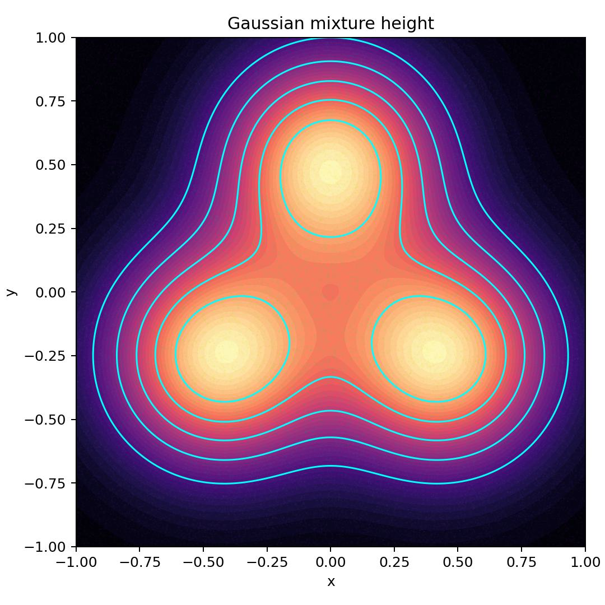
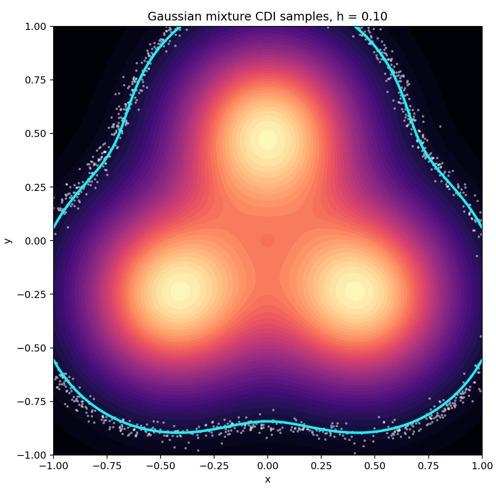
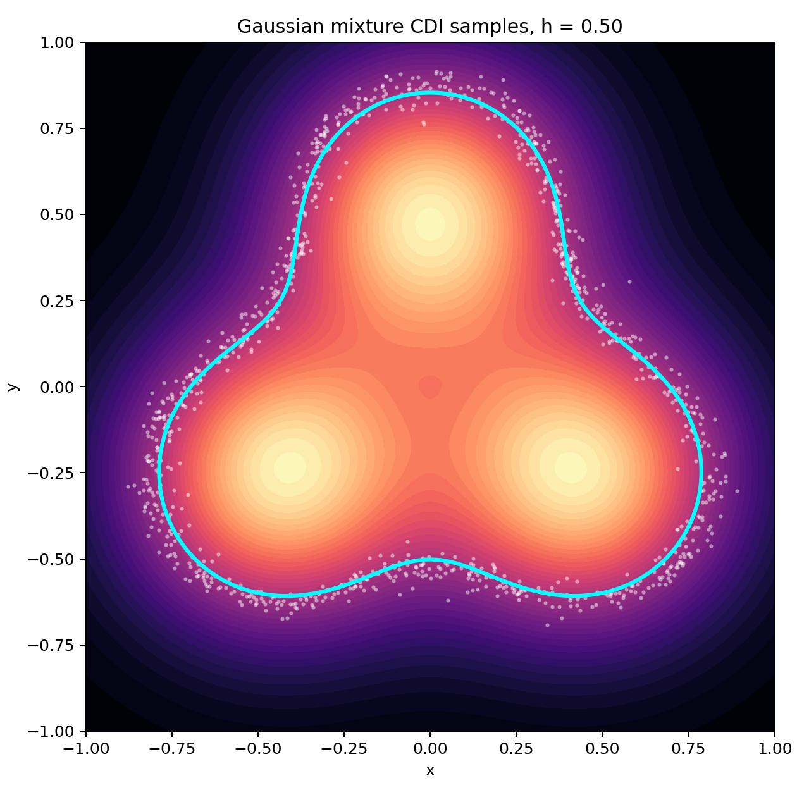
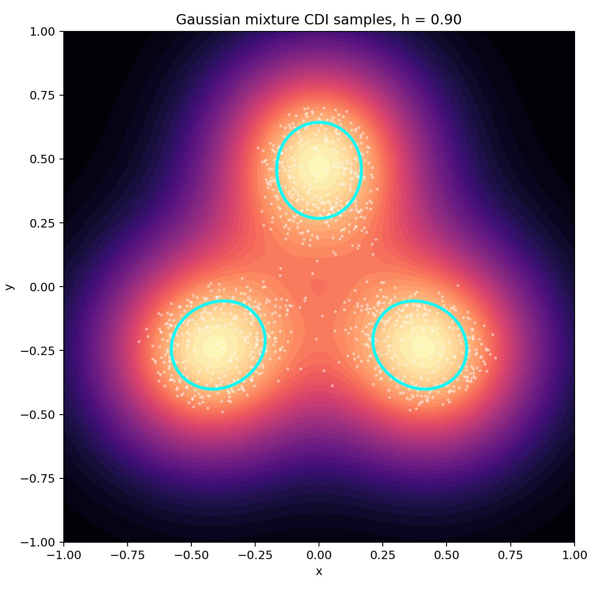
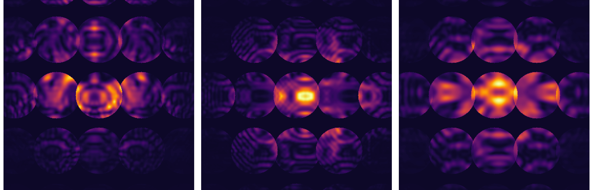

# CDI: Conditional Diffusion Inference for CBED

## Overview

This repository provides a reference implementation of Conditional Diffusion
Inference (CDI), a diffusion-based approach for system parameter identification
with uncertainty quantification.

The CDI framework has been successfully applied to
[power grid parameter estimation](https://www.nature.com/articles/s44172-026-00670-z),
and the [CBED](https://journals.aps.org/prmaterials/abstract/10.1103/qdpk-6mnv)
[inverse problems](https://iopscience.iop.org/article/10.1088/2632-2153/ae7f7b/meta).
The original JCDI code was implemented by Feiqin Zhu
[@fq123fq](https://github.com/fq123fq) and is available at
[fq123fq/JCDI-power-grid](https://github.com/fq123fq/JCDI-power-grid).


**What problem does CDI solve?**

CDI solves the system parameter identification problem (inverse problem):
we observe a system behavior and want to infer system parameters that can
produce this behavior.

CDI solves the inverse problem by learning a distribution of parameters
`p(parameters | observation)` which are consistent with the observation.
Once such a distribution is learned, it can be used to solve the inverse
problem for new observations.

This repository includes a small Gaussian-mixture level-set problem to
illustrate the model application and the application of the CDI to a real world
scientific problem.


## Quick Start Guide

This section demonstrates application of CDI on a small synthetic inverse
problem with a simple visual interpretation. The example can be quickly run
on a modest GPU and is meant to show the basic workflow: define a forward
process, train CDI on parameter-output pairs, then sample many plausible
inverse solutions for a fixed observation.

As the example problem, we consider a 2D surface with coordinates `(x, y)`.
At each location, we can measure its height `h`. This measurement creates a
forward problem: mapping a location `(x, y)` to a height `h`.

We can use CDI to solve the inverse problem: given only a height `h`, find the
locations `(x, y)` that could have produced it. For many complex surfaces, this
problem is inherently ill-defined, as there are many points `(x, y)` that have
the same height `h`.

For this example, we construct the surface by adding together three Gaussian
bumps, as illustrated in the figure below. The cyan lines show contours of
constant height: every point on the same line has the same value of `h`. This
makes the inverse problem highly degenerate. If we are only given the height
`h`, there may be many different locations `(x, y)` that explain it equally
well.


<table>
  <tr>
    <td width="42%">
      
    </td>
    <td width="42%">
      <h3>Forward</h3>
      <p><code>(x, y) &rarr; h</code></p>
      <p>Measure the height at a chosen location.</p>
      <h3>Inverse</h3>
      <p><code>h &rarr; (x, y)</code></p>
      <p>Find locations that have the requested height.</p>
      <h3>CDI</h3>
      <p><code>p((x, y) | h)</code></p>
      <p>Learns the full set of plausible inverse solutions.</p>
    </td>
  </tr>
</table>


CDI is built on a diffusion model architecture. To use it, we first train the
model on random pairs `((x, y), h)` sampled from the forward problem. The model
learns which locations tend to produce each height. After training, the
model can be given a height `h` and generate a distribution of locations
`(x, y)` that can produce the given height. The training and sampling
procedures are described below.

### Training

To train the CDI model on the gaussian mixture dataset, run the following
command from the root of the repository:

```bash
python3 scripts/train/gaussian_mixture/train_gaussian_mixture_2d.py
```

Once launched, this command will start the CDI model training and display its
progress. On NVIDIA RTX 3090, it takes about 5 minutes to complete the training.

After the training has finished, the trained model will be saved under `outdir/`
(or "${CDI_OUTDIR}" if set) and can be found by the following path:
```
outdir/gaussian_mixture/gaussian_mixture_2d/model_m(cdi)_cdi
```

See [Model Directory Structure](#model-directory-structure) for details on the
saved model directory.


### Sampling

<p align="center">
  
  
  
</p>

After the training is complete, the CDI model can be used to solve the inverse
problem for an arbitrary height `h` value. The following command can be used
to generate a distribution of `(x, y)` values with the trained model:

```bash
python3 scripts/eval/gaussian_mixture/eval_gaussian_mixture_2d.py \
    "outdir/gaussian_mixture/gaussian_mixture_2d/model_m(cdi)_cdi" \
    --h-level 0.1 --n-samples 1024 --batch-size 1024 --output gm_0.1.jpg
```

Here `--h-level` specifies the height; `--n-samples` is the number of `(x, y)`
points consistent with the `h-level` to sample. The command will sample 1024
`(x, y)` points that correspond to height 0.1 and save the results to
`gm_0.1.jpg`.

The figure in the beginning of this section shows an example of plots for
`h = 0.1` (left), `h = 0.5` (middle), and `h = 0.9` (right). The cyan contours
show the ground truth contours obtained from a mathematical model, while the
white dots demonstrate CDI model predictions.


### Adapting to Your Own Data

To apply CDI to a different inverse problem, use the toy example training script
as a starting point. The script
`scripts/train/gaussian_mixture/train_gaussian_mixture_2d.py` contains a
declarative configuration showing how to define the forward process, set up the
dataset, and configure the diffusion model for a 2D parameter space.

You will need to implement a custom dataset for your data. Subclass
`torch.utils.data.Dataset` in `cdi/data/datasets/`, implement `__getitem__` to
return `(condition, target)` pairs, and register it in `DSET_DICT` in
`cdi/data/datasets/__init__.py`. The `shapes` field in the data config declares
the expected `[condition_shape, target_shape]` — the framework uses this to
configure the encoder and denoiser automatically.

If your condition data has a different structure than the built-in encoders
expect (e.g., it is neither a low-dimensional vector nor a 2D image), implement
a custom encoder in `cdi/nn/encoder/` and register it in `ENCODERS`. The encoder
must output tokens of shape `(N, L_cond, features_cond)`.

For a more complex example with image conditions and a ResNet encoder, see
`scripts/train/cbed/f11/cdi/train_diffusion_resnet34_crop320_aug_times.py`.


## Installation

Installation has three steps: set up a Python environment with PyTorch, install
the CDI package, and (optionally) configure data and output directories.

NOTE: The package was tested only under Linux systems.

### Environment Setup

The package was developed and tested under the
`pytorch/pytorch:2.2.2-cuda12.1-cudnn8-devel` container.

There are several ways to set up a similar package environment:

**Option 1: Docker or Singularity**

Download the container `pytorch/pytorch:2.2.2-cuda12.1-cudnn8-devel`.
Inside the container, create a virtual environment to avoid package conflicts:

```bash
python3 -m venv --system-site-packages ~/.venv/cdi
source ~/.venv/cdi/bin/activate
```

**Option 2: Conda**

```bash
conda env create -f contrib/conda_env.yaml
conda activate cdi
```

### Install Package

Once the environment is set, install the `cdi` package and its requirements:

```bash
pip install -r requirements.txt
pip install -e .
```

### Environment Variables

By default, CDI reads datasets from `./data` and saves models to `./outdir`.
If any other location is desired, these defaults can be overridden with:

```bash
export CDI_DATA=/path/to/datasets
export CDI_OUTDIR=/path/to/models
```

## CBED Paper Reproduction

The Gaussian mixture example above serves as an illustrative problem with a
clean visual interpretation. The experiments in this section apply CDI to a
real inverse problem from
[materials science](https://iopscience.iop.org/article/10.1088/2632-2153/ae7f7b/meta).

The sections below give a conceptual overview of the CBED problem and walk
through reproducing the CBED experiments. The reproduction process has three
steps: prepare the dataset, train the models, run evaluation.


## The CBED Inverse Problem

Convergent beam electron diffraction (CBED) is a technique for measuring
crystal structure at the nanoscale. The setup is as follows. A beam of
electrons is scattered off a thin crystal. The electrons diffract, and the
detector records a pattern of bright and dark disks -- (cf. the image below).
That pattern encodes the local crystal structure: thickness, lattice
parameters, and various beam properties.



The forward problem is well understood. Given a set of crystal parameters, the
diffraction pattern can be simulated accurately. The inverse problem is to find
a set of parameters that can be used to create the given CBED pattern.


### Dataset

The training data was generated from raw binary simulation files (.ity)
produced by the CBED simulation code. These files were converted to
numpy arrays -- one per diffraction pattern -- along with corresponding
parameter labels. At full resolution (640x640, fp32), the dataset exceeds 1 TB,
which makes it impractical to share directly. Below, we provide two ways the
dataset can be obtained.


#### Compressed H5 Dataset (Zenodo)

If you do not have access to the simulation files, a compressed version of the
dataset is available on Zenodo:

- Test split (`f11f`): https://zenodo.org/records/18340683
- Training split, Part 1 (`f11a`): https://zenodo.org/records/18344486
- Training split, Part 2 (`f11b`): https://zenodo.org/records/18356685
- Training split, Part 3 (`f11c`, `f11e`): https://zenodo.org/records/18476248

To reduce the size, the patterns were downcasted from fp32 to fp16 and
center-cropped from 640x640 to 320x320. This is sufficient for running
evaluation (which uses center crops regardless) and for approximate training.
The total download is approximately 110 GB.

NOTE: If you intend to only perform model evaluation, `f11f` part of the
dataset should be sufficient.

Once downloaded, unpack the resulting tar archives and place their contents
under `$CDI_DATA/cbed/f11_h5/`.

The expected dataset layout should look like the following:

```text
$CDI_DATA/cbed/f11_h5/
  f11a/
    labels.csv
    f11a_cbed0000000.ity.h5
    f11a_cbed0000001.ity.h5
    ...
  f11b/
    ...
  f11c/
    ...
  f11e/
    ...
  f11f/
    ...
```

After the dataset has been downloaded and extracted, please refer to the
reproducing Train/Test splits section below.


#### Regenerating from Raw Simulation Files

If you have access to the raw simulation files, you can regenerate the full
dataset using the scripts in `scripts/data/cbed/`. Please refer to
`scripts/data/cbed/README.md` for unpacking and label generation (the
train/test split regeneration will be explained below).  This path gives you
the original resolution and allows training with random crops, which is what
the paper experiments used.

The expected dataset layout after regeneration:

```text
$CDI_DATA/cbed/f11/
  f11a/
    labels.csv
    f11a_cbed0000000.ity/
      sample_00000.npz
      sample_00001.npz
      ...
  f11b/
    ...
  f11c/
    ...
  f11e/
    ...
  f11f/
    ...
```

#### Reproducing Train/Test Splits

After the dataset preparation steps above, the dataset is organized into
subdirectories (`f11a`, `f11b`, `f11c`, `f11e`, `f11f`), each containing a
`labels.csv` file and the corresponding pattern data.

The manuscript performed the Train/Test split as:
- Train Split: `f11a`, `f11b`, `f11c`, `f11e`
- Test (and Val) Split: `f11f`

The train/validation/test splits are not created automatically. Once the data
is in place, create them by symlinking the label files:


1. Training subdirs (`f11a`, `f11b`, `f11c`, `f11e`):

```bash
cd $CDI_DATA/cbed/f11/f11a
ln -s labels.csv labels_train.csv
```

and repeat for the remaining directories. Use `f11_h5` directory if you
downloaded a compressed h5 dataset.

2. Test subdir `f11f`
```bash
cd $CDI_DATA/cbed/f11/f11f
ln -s labels.csv labels_test.csv
ln -s labels.csv labels_val.csv
```

Creating these symlinks will tell the `cdi-uq` dataset to treat `f11f`
subdirectory as containing the test (and val) dataset and the remaining
subdirectories as containing the training dataset.


### Models

Before CDI models can be used to generate predictions, they need to be trained.

There are three ways to obtain trained models: download pretrained checkpoints
from Zenodo, train from scratch on the full numpy dataset, or adapt the
training scripts for the compressed H5 dataset. The first two are officially
supported; the third is possible but requires manual changes.


#### Download Pretrained Models

Pretrained models are available on Zenodo:
https://zenodo.org/records/21707851. Download and place them under
`${CDI_OUTDIR}`. Each model directory is self-contained -- please refer to
[Model Directory Structure](#model-directory-structure) for details on what's
inside.
Evaluation scripts take the model directory as their first argument; no
additional configuration is needed.


#### Train from NumPy Dataset

If you have the full numpy dataset, use the provided training scripts:

```bash
# Deterministic ResNet-50 baseline
python3 scripts/train/cbed/f11/resnet/train_resnet50_crop320_augs.py

# CDI diffusion model
python3 scripts/train/cbed/f11/cdi/train_diffusion_resnet34_crop320_aug_times.py
```

Training outputs are written under `${CDI_OUTDIR:-outdir}`.

The scripts contain a declarative configuration at the top -- dataset paths,
model architecture, augmentations, hyperparameters. You can inspect and modify
these directly.


#### Train from H5 Dataset

The training scripts above expect the numpy dataset layout. It is possible
to adapt them for the training on the compressed h5 dataset, however.
This adaptation is not officially supported, as the compressed files contain
only the central 320x320 crops out of the full 640x640 patterns, making
the faithful paper reproduction not possible. However, if one wishes to train
on the compressed H5 dataset, it is possible by modifying the training scripts
above and performing the following changes:

1. Point the dataset configuration at the H5 data directory and switch to the
   H5 dataset class.
2. Adjust training data augmentations to work on images of size 320x320
   (`TRANSFORM_F11_TRAIN` configuration).

The configuration `configs/eval/cbed/f11_h5.json` provides an example config
that works with the H5 dataset.


### Evaluation

Once you have a trained or downloaded model, the evaluation scripts let you
inspect its predictions. The model takes a CBED pattern as input and outputs
estimates of the 13 target parameters (Debye-Waller factors, structure factors,
beam tilt angles, and sample thickness). This repository provides scripts for
the following evaluations:

1. **Point predictions.** Run the model once per sample to get a single
   parameter estimate.

2. **Posterior samples.** Run the model multiple times per observation to see
   the full conditional distribution.

Both work with the numpy dataset and the compressed H5 dataset. The H5 path
requires two extra flags (`--data-config` and `--data-path`).


#### Point Predictions and Metrics

We can use the trained model to produce a single prediction per sample
in the test dataset:

```bash
python3 scripts/eval/cbed/save_predictions.py MODEL_DIR \
    --data-name f11 \
    --label test
```

This command will run the model over the test dataset and create a csv file
`MODEL_DIR/evals/final/predictions_test.csv`. The file will contain one row
per sample in the test dataset. The columns contain predicted values and
ground truth values per parameter:
- `preds_f11_0`, `preds_f11_1`, ... — predicted CBED parameters indexed by
  0, 1, ..., 12. The indices map to: 0–2 Debye-Waller factors for Mg,
  3–5 Debye-Waller factors for B, 6–9 low-order structure factors,
  10–11 beam tilt angles ($\theta_x$, $\theta_y$), 12 sample thickness.
  See the paper for the full parameter specification.
- `targets_f11_0`, `targets_f11_1`, ... — ground truth CBED parameters from the
  test dataset.

The resulting file `MODEL_DIR/evals/final/predictions_test.csv` is a per-sample
prediction. To compute an average per-parameter metric (MAE, RMSE, etc.)
instead, one can further post-process this file with:

```bash
python3 scripts/eval/cbed/evaluate_predictions.py \
    MODEL_DIR/evals/final/predictions_test.csv
```

This produces `MODEL_DIR/evals/final/predictions_test_summary.csv` containing
per-parameter statistics.

**Using the H5 dataset.** If you are using a compressed H5 dataset, the
`save_predictions` command would require two additional arguments
`--data-config` and `--data-path`:

```bash
python3 scripts/eval/cbed/save_predictions.py MODEL_DIR \
    --data-name f11 \
    --label h5 \
    --data-config configs/eval/cbed/f11_h5.json \
    --data-path $CDI_DATA/cbed/f11_h5
```

#### Posterior Samples

Alternatively, to sample the full conditional distribution for each
observation:

```bash
python3 scripts/eval/cbed/sample_posterior_distribution.py MODEL_DIR \
    --data-name f11 \
    --label posterior \
    --limit 10 \
    --distribution-size 1024
```


This creates a directory `MODEL_DIR/evals/final/distribution_posterior/`.
It will contain 10 files, one per the test pattern being evaluated. Each
file is a csv table containing 1024 rows -- independent samples drawn from
a posterior distribution for the corresponding pattern. Since generating 1024
posterior samples per observation is computationally expensive, `--limit`
limits the number of observations evaluated so the run completes in a
reasonable time.

**Using the H5 dataset.** Add `--data-config` and `--data-path`:

```bash
python3 scripts/eval/cbed/sample_posterior_distribution.py MODEL_DIR \
    --data-name f11 \
    --label posterior \
    --limit 10 \
    --distribution-size 1024 \
    --data-config configs/eval/cbed/f11_h5.json \
    --data-path $CDI_DATA/cbed/f11_h5
```


## Notes

### Output Directories

Training and evaluation outputs are written under `${CDI_OUTDIR:-outdir}`.
Each model directory contains its configuration, checkpoints, network weights,
and generated evaluation files.

### Model Directory Structure

CDI saves each trained model in a separate directory. A typical model directory
contains:

- `config.json` -- model, data, training, and evaluation configuration.
- `net_*.pth` -- PyTorch weights of model networks.
- `opt_*.pth` -- PyTorch state of training optimizers.
- `checkpoints/` -- training checkpoints.
- `evals/` -- evaluation results produced by evaluation scripts.

### Evaluating H5 Data

Use `--data-config configs/eval/cbed/f11_h5.json` and point `--data-path` at
the repacked H5 dataset root.

## LICENSE

`cdi` is distributed under `BSD-2` license.

`cdi` repository contains bundled diffusion utilities from the LS4GAN diffusion
code released in [LS4GAN/calo-ddpm][caloddpm_repo]. This code is also licensed
under `BSD-2` license (please refer to `cdi/bundled/diffusion/LICENSE` for
details).

`cdi` also bundles local training/config/checkpoint helper code in
`cdi/bundled/leanbase`. This code is licensed under `BSD-2` license (please
refer to `cdi/bundled/leanbase/LICENSE` for details).

The conditional diffusion transformer architecture in `cdi/nn/conditional_dm`
is adapted from [fq123fq/JCDI-power-grid][jcdi_repo]. This code is licensed
under `MIT` license (please refer to `cdi/nn/conditional_dm/LICENSE` and
`cdi/nn/conditional_dm/NOTICE.md` for details).

[caloddpm_repo]: https://github.com/LS4GAN/calo-ddpm
[jcdi_repo]: https://github.com/fq123fq/JCDI-power-grid

## Citation

```bibtex
@misc{cdi_cbed,
  title  = {Conditional Diffusion Inference for CBED},
  author = {The CDI Project Developers},
  year   = {2026},
  url    = {https://github.com/realtime-intelligence/cdi-uq}
}
```
